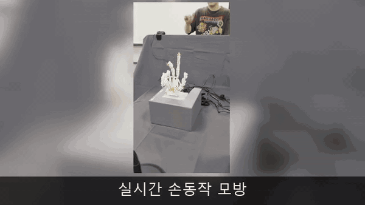

<p align="center">
  
</p>

<h1 align="center">THING</h1>

<p align="center">
  <strong>사람의 손동작을 인식해 실시간으로 따라 움직이는 7축 텐던 로봇 손</strong>
</p>

<p align="center">
  MediaPipe · ROS 2 · DYNAMIXEL · React · Django
</p>

THING은 사용자의 손동작을 실시간으로 인식해 7축 텐던 구동 로봇 손으로 재현하는
ROS 2 기반 Human-Mimetic Robot Hand입니다. MediaPipe가 검출한 21개 손 landmark를
네 손가락의 굽힘과 엄지의 굽힘·대립·벌림으로 구성된 7개 논리축 명령으로 변환합니다.

Jetson Orin Nano는 비전 인식과 데이터 기록을, Raspberry Pi 5는 명령 중재·안전
검증과 DYNAMIXEL 제어를 담당합니다. React 관제 웹과 AWS EC2 데이터 포털을 연결해
실시간 모방부터 실험 데이터 저장·조회까지 하나의 흐름으로 구현했습니다.

> **구현 결과**
>
> 비전 인식, 명령 중재, 안전 검증, 7축 모터 구동, 웹 관제, 데이터 기록·업로드를
> 통합했으며 실제 텐던 로봇 손으로 손동작 모방과 물체 파지 시연을 완료했습니다.

## 시연

### 최종 통합 시연

사용자의 손동작 인식부터 7축 텐던 로봇 손의 실시간 모방까지 이어지는 최종 시연입니다.

https://github.com/user-attachments/assets/3f23d3e1-5532-4831-a1eb-fe4c024d04cb

> [원본 최종 시연 영상 열기](media/videos/모방시연.mp4)

### 동작 하이라이트

<p align="center">
  
</p>

<p align="center">
  <sub>모방·파지·독립 관절 동작을 짧게 연결한 미리보기입니다.</sub>
</p>

### 개별 시연 영상

<details>
<summary><strong>전체 원본 영상 펼쳐보기</strong></summary>

#### 통합·모방

- [최종 손동작 모방 시연](media/videos/모방시연.mp4)
- [7축 구동 시연](media/videos/최종시연.mp4)
- [여러 손동작 모방](media/videos/모방여러동작.mp4)
- [지연 개선 후 웨이브 모방](media/videos/모방웨이브지연개선.mp4)

#### 파지·시퀀스

- [캔 파지 모방](media/videos/모방캔파지.mp4)
- [유연한 물체 파지](media/videos/파지말랑이.mp4)
- [손목보호대 파지](media/videos/파지손목보호.mp4)
- [엄지 3축 동작](media/videos/엄지축.mp4)
- [손가락 웨이브](media/videos/파도타기.mp4)
- [카운트다운 시퀀스](media/videos/카운트다운.mp4)

</details>

원본 MP4 영상은 Git LFS로 관리합니다.

## 핵심 구현

| 영역 | 구현 내용 |
| --- | --- |
| 기구·전자 | 3D 프린팅 텐던 로봇 손, CAD·STL·URDF, 7축 DYNAMIXEL 배선과 안전 전원 |
| Vision | 카메라 프레임에서 MediaPipe 기반 21개 3D landmark 검출 및 정규화된 7축 `HandCommand` 생성 |
| 제어·안전 | MIMIC·MANUAL·TELEOP 명령 중재, Command Guard, Watchdog, E-Stop 및 XL330-M288-T 7축 제어 |
| 관제 UI | WebSocket·MJPEG 기반 영상·랜드마크·모터·안전 상태 확인 및 모방·수동 조작 |
| 기록·데이터 | rosbag2 기록, metadata·Landmark JSON과 HandCommand·MotorStatus CSV 변환 및 HTTPS 업로드 |
| 데이터 포털 | Django API와 React UI를 통한 세션별 실험 데이터 조회·다운로드 |

## Vision 기반 7축 변환

```text
RGB Camera
  → MediaPipe 21 Landmarks
  → 관절각·손바닥 폭 기반 정규화
  → 사용자 Calibration
  → Median·EMA·Deadband·Rate Limit
  → 7축 HandCommand
```

7개 논리축은 다음과 같습니다.

```text
엄지 굽힘 · 엄지 대립 · 엄지 벌림
검지 굽힘 · 중지 굽힘 · 약지 굽힘 · 소지 굽힘
```

사람 손의 모든 자유도를 독립적으로 복제하는 대신, 파지에 자주 사용되는 관절 움직임을
7개 구동 시너지로 축약해 실시간성과 구현 가능성을 확보했습니다.

## 시스템 구성

```text
사용자 손
  → Camera / MediaPipe / 7축 목표 생성                (Jetson Orin Nano)
  → command_manager / command_guard / safety_manager (Raspberry Pi 5)
  → DYNAMIXEL XL330-M288-T × 7
  → 텐던 로봇 손

카메라·로봇 상태
  → Web Bridge (WebSocket + MJPEG)
  → React 관제·제어 웹                               (Laptop)

동작 데이터
  → rosbag2 → exporter → uploader                    (Jetson Orin Nano)
  → Django API / SQLite / 파일 저장                  (AWS EC2)
```

웹은 모터를 직접 제어하지 않습니다. 모든 일반 명령은 Raspberry Pi의 명령 중재와
안전 검증을 통과하며, 네트워크 복구 후에도 사용자의 명시적인 입력 전에는 자동으로
로봇 손을 움직이지 않습니다.

## 데이터 기록 원칙

- 카메라와 MJPEG 스트림은 상시 실행합니다.
- 기록은 `MIMIC` 모드에서만 사용자가 버튼으로 시작·종료합니다.
- 원본 영상은 저장하지 않고 landmark, 7축 명령과 모터 상태를 rosbag2로 기록합니다.
- 기록 종료 후 성공·실패 판정을 완료해야 다음 기록을 시작할 수 있습니다.
- 세션별로 아래 4개 학습용 파일을 생성합니다.

```text
metadata.json
landmark.json
hand_command.csv
motor_status.csv
```

## 기술 스택

| 구분 | 기술 |
| --- | --- |
| Robot·Edge | ROS 2 Humble, Cyclone DDS, Jetson Orin Nano, Raspberry Pi 5 |
| Vision | MediaPipe 0.10.9, OpenCV, Python, CvBridge |
| Control | Python, C++, DYNAMIXEL SDK, XL330-M288-T, U2D2 |
| Web | React 19, Vite 8, Tailwind CSS 4, WebSocket, MJPEG |
| Data·Backend | rosbag2, Django 6, DRF, Gunicorn, Nginx, SQLite, AWS EC2 |
| Fabrication | Blender, 3D Printing, Tendon-driven Underactuated Mechanism |
| Collaboration | Jira, GitLab Flow, Merge Request, Git LFS |

## 빠르게 확인하기

### 저장소 받기

CAD·STL·영상 파일을 내려받으려면 Git LFS가 필요합니다.

```bash
git lfs install
git clone https://github.com/binedwin/hand_mimic.git
cd hand_mimic
git lfs pull
```

### 로봇 없이 관제 UI 실행

```bash
cd web/frontend
npm ci
npm run mock
```

다른 터미널에서 실행합니다.

```bash
cd web/frontend
npm run dev
```

### ROS 2 패키지 빌드

Ubuntu 22.04와 ROS 2 Humble 환경을 기준으로 합니다.

```bash
source /opt/ros/humble/setup.bash
cd thing_ws
rosdep install --from-paths src --ignore-src -r -y
colcon build --symlink-install
source install/setup.bash
colcon test
colcon test-result --verbose
```

실물 장비에 토크를 인가하기 전에 장치별 설정과 안전 문서를 먼저 확인하세요.

## 저장소 구성

| 경로 | 내용 |
| --- | --- |
| [`mechanical/`](mechanical/) | CAD, STL, 도면과 조립 자료 |
| [`electronics/`](electronics/) | BOM, 회로, 배선과 안전 전원 자료 |
| [`thing_ws/`](thing_ws/) | ROS 2 인터페이스·비전·제어·하드웨어·로거·Web Bridge·Bringup |
| [`web/frontend/`](web/frontend/) | 내부망 React 관제·제어 UI |
| [`scripts/`](scripts/) | Jetson 비전·Web Bridge 실행 스크립트 |
| [`exec/`](exec/) | 포팅 매뉴얼과 시연 실행·종료 스크립트 |
| [`EC2/thing_database_web/`](EC2/thing_database_web/) | 실험 데이터 포털 프런트엔드·백엔드 |
| [`tests/`](tests/) | 자동화 테스트와 실물 시험 절차 |
| [`docs/`](docs/) | 요구사항, 아키텍처, 인터페이스, 환경 설정과 개발 기록 |
| [`media/`](media/) | 프로젝트 이미지와 시연 영상 |

## 주요 문서

- [요구사항 명세서 V7.1](docs/requirements/요구사항%20명세서%20V7.1.md)
- [포팅 매뉴얼](exec/포팅_매뉴얼.md)
- [시스템 아키텍처](docs/architecture.md)
- [ROS 2·Web·EC2 인터페이스](docs/interfaces.md)
- [Safety Manager](docs/safety_manager.md)
- [DYNAMIXEL 설정](docs/setup/dynamixel.md)
- [내부 관제 웹](web/README.md)
- [Web Bridge](thing_ws/src/thing_web_bridge/README.md)
- [Logger·Landmark JSON 계약](thing_ws/src/thing_logger/README.md)
- [기구 자료](mechanical/README.md)
- [전자·배선 자료](electronics/README.md)
- [시험 절차](tests/README.md)
- [EC2 데이터 포털](EC2/README.md)

## Contributors

<p align="center"><strong>SSAFY</strong></p>

<table align="center">
  <tr>
    <td align="center" width="160">
      <a href="https://github.com/binedwin">
        <br>
        <strong>이정빈</strong>
      </a><br>
      <sub>팀장 · EMB/AI</sub>
    </td>
    <td align="center" width="160">
      <a href="https://github.com/s0415j">
        <br>
        <strong>신수진</strong>
      </a><br>
      <sub>EMB/BE</sub>
    </td>
    <td align="center" width="160">
      <a href="https://github.com/akdlxm39">
        <br>
        <strong>백지웅</strong>
      </a><br>
      <sub>EMB/HW</sub>
    </td>
  </tr>
  <tr>
    <td align="center" width="160">
      <a href="https://github.com/yjmini">
        <br>
        <strong>윤정민</strong>
      </a><br>
      <sub>EMB/AI</sub>
    </td>
    <td align="center" width="160">
      <a href="https://github.com/lab0-hibears">
        <br>
        <strong>김기현</strong>
      </a><br>
      <sub>Web/AI</sub>
    </td>
    <td align="center" width="160">
      <a href="https://github.com/SeMinKong">
        <br>
        <strong>공세민</strong>
      </a><br>
      <sub>EMB/HW</sub>
    </td>
  </tr>
</table>

## 안전

실제 모터에 토크를 인가하기 전에 모터 ID, 이동 범위, 전류 제한, 텐던 장력과
비상 정지·전원 차단 수단을 확인해야 합니다.

- [DYNAMIXEL 도구와 기본 점검](tools/dynamixel/README.md)
- [모터 제어 안전 지침](docs/motor-control/dynamixel/safety.md)
- [Raspberry Pi 현장 제어 안내](tools/dynamixel/rpi/README.md)

## 라이선스

이 프로젝트는 [Apache License 2.0](LICENSE)으로 배포됩니다.
